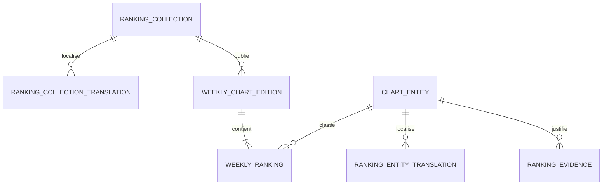

# Feuille de route SEO et recherches cibles

État au 9 octobre 2026. Ce document distingue l'observation de SERP, les hypothèses d'intention et les mesures à collecter. Il ne promet pas la première position : aucun classement ne peut être garanti par un changement de code.

## Positionnement éditorial

Deux chemins d'entrée se renforcent :

1. **Découvrir et regarder des podcasts** — pages de série, épisode, thème, personne et ressources, avec une bibliothèque rapide et un lecteur vidéo.
2. **Comparer les outils et classements IA** — éditions datées, fiches de skill/modèle/projet, méthode publique, sources et analyses humaines.

Le site peut viser les recherches contenant « meilleur », mais un rang calculé sur l'activité GitHub ne prouve pas la qualité fonctionnelle. La popularité, la croissance, le benchmark de performance et le test éditorial gardent des noms, données et méthodes distincts. C'est la base de la confiance et du différenciateur éditorial.

## État de la traduction des classements

Les classements disposent de libellés dans les quatre langues du site. Le français et l'anglais restent les seules interfaces approuvées. Les textes espagnols et allemands sont des brouillons à relire ; leurs pages restent `noindex`, selon [DD-0010](../design-decisions/DD-0010-quatre-langues-du-site.md).

Cette couverture concerne seulement les libellés de classement. Chaque collection et chaque entité doit encore recevoir son propre titre, résumé, méthode et profil traduit dans les tables de localisation, puis être relu avant publication. Les pages ne deviennent indexables qu'après cette revue et la publication de données réelles suffisantes.

## Recherche de requêtes

Les formulations ci-dessous sont des clusters prioritaires, pas des volumes mensuels. Ils viennent du vocabulaire demandé par l'équipe et d'un échantillon de résultats organiques consulté le 8 octobre 2026. Cet échantillon fait apparaître des pages françaises pour « meilleurs skills Codex » et plusieurs guides anglais qui ciblent déjà les skills Claude Code ; le segment anglophone est donc plus concurrentiel, tandis que le français a encore de l'espace mais comporte des agrégateurs. Voir [Skills Guide — meilleurs skills Codex](https://skills-guides.com/fr/skills/meilleurs/codex), [Launch Vault — Claude Code skills](https://www.launchvault.dev/blog/best-claude-code-skills-2026), [OpenAIToolsHub — skills Claude Code](https://www.openaitoolshub.org/en/blog/best-claude-code-skills-2026) et [DesignRevision — sélection Claude Code](https://designrevision.com/blog/best-claude-code-skills).

| Priorité | Langue | Cluster / formulations à couvrir                                                             | Intention                                    | Page cible proposée                                                        | Condition éditoriale                                                                      |
| -------- | ------ | -------------------------------------------------------------------------------------------- | -------------------------------------------- | -------------------------------------------------------------------------- | ----------------------------------------------------------------------------------------- |
| P1       | FR     | meilleurs skills pour Claude Code; skills Claude Code GitHub; skills à installer Claude Code | Choisir des extensions de code               | `/charts/skills/claude-code`                                               | Compatibilité vérifiée, classement éditorial évalué et date de test visible               |
| P1       | FR     | meilleurs skills Codex; skills pour Codex; Codex skills GitHub                               | Trouver et installer des skills compatibles  | `/charts/skills/codex`                                                     | Identifiants de format, compatibilité, procédure de test et preuve source                 |
| P1       | EN     | best Claude Code skills; Claude Code skills ranked; best skills to install for Claude Code   | Découverte et comparaison                    | `/en/charts/skills/claude-code`                                            | Version anglaise revue et évaluation originale, pas traduction brute                      |
| P1       | EN     | best Codex skills; Codex skills GitHub; skills for OpenAI Codex                              | Trouver des skills utilisables               | `/en/charts/skills/codex`                                                  | Même méthode que la version FR, texte localisé et révisé                                  |
| P2       | FR     | meilleurs skills IA; meilleurs skills pour ChatGPT; skills d'agent IA                        | Découverte générale, expression ambiguë      | `/charts/skills` puis `/charts/skills/chatgpt` si le périmètre est vérifié | Séparer skills de code, capacités natives ChatGPT, GPTs et prompts ; ne pas les fusionner |
| P2       | EN     | best AI agent skills; best ChatGPT skills; AI agent skills directory                         | Recherche de catalogue                       | `/en/charts/skills` puis route dédiée si même intention vérifiée           | Expliquer précisément ce que « skill » veut dire dans chaque environnement                |
| P1       | FR     | meilleurs modèles IA pour coder; classement modèles IA; meilleurs modèles IA open source     | Comparer un modèle à une tâche               | `/charts/models/coding`, `/charts/models/open-source`                      | Résultats benchmark datés, protocole, version du modèle et source indépendante/éditeur    |
| P1       | EN     | best AI models for coding; open-source AI model leaderboard; AI model rankings               | Comparer performance et licence              | `/en/charts/models/coding`, `/en/charts/models/open-source`                | Même modèle de preuve, prix/vitesse seulement avec source et date                         |
| P2       | FR     | projets IA GitHub populaires; projets IA GitHub qui montent; tendances IA GitHub             | Suivre adoption et accélération              | `/charts/github`, `/charts/rising`                                         | Appeler cela popularité/croissance, jamais « qualité »                                    |
| P2       | EN     | trending AI GitHub repositories; fastest-growing AI projects; AI GitHub leaderboard          | Veille et découverte                         | `/en/charts/github`, `/en/charts/rising`                                   | Historique réel et fenêtres de mesure visibles                                            |
| P2       | FR/EN  | podcasts IA, podcast intelligence artificielle, AI podcasts, [thème + podcast]               | Écouter, trouver un épisode ou une ressource | `/episodes`, `/topics/{slug}`, `/episodes/{number}` et variantes `/en/`    | Épisodes réels, descriptions uniques, personne/source/chapitres exacts                    |

### Priorisation

- **P1** : forte proximité avec les classements envisagés et une intention de choix explicite ; démarrer par skills Claude Code/Codex et modèles pour une tâche, dès que les données réelles et les évaluations existent.
- **P2** : hubs et requêtes de découverte plus larges ; les publier quand le catalogue est assez riche pour être utile.
- Les mots « ChatGPT skills » ont une ambiguïté de produit. La page doit distinguer skills portables, fonctionnalités natives, GPTs personnalisés et bibliothèques de prompts. Si le classement ne traite pas réellement le besoin, ne pas créer la page juste pour capter la requête.

## Architecture de contenu et maillage

| Niveau      | Page                                                 | Rôle et liens internes                                                                                                      |
| ----------- | ---------------------------------------------------- | --------------------------------------------------------------------------------------------------------------------------- |
| Accueil     | `/` et `/en/`                                        | Deux entrées visibles : bibliothèque podcast et classements IA ; mettre en avant une édition actuelle et un épisode réel    |
| Hub         | `/charts` et `/en/charts`                            | Expliquer les familles et les méthodes, pointer vers Skills, Models, GitHub et Rising                                       |
| Collection  | `/charts/skills`, `/charts/models`, `/charts/github` | Résumer le périmètre, la période, les sources, l'édition en cours et les pages par tâche/plateforme                         |
| Intent page | `/charts/skills/{platform}`; `/charts/models/{task}` | Répondre à une recherche précise, inclure les critères, les rangs, limites, méthode et alternatives                         |
| Archive     | `/charts/{collection}/{week}`                        | Édition historique canonique datée, liée à la page de collection et à l'édition précédente/suivante                         |
| Profil      | `/charts/project/{slug}` ou futur profil skill/model | Source canonique, faits, compatibilité, historique et contenu distinctif ; liens vers les classements et épisodes concernés |
| Média       | `/episodes/{number}`, `/topics/{slug}`               | Description utile, vidéo, transcript/chapitres s'ils sont fiables, ressources et liens vers les classements pertinents      |

On conserve les chemins français déjà en usage. Les trois autres langues utilisent `/en/`, `/es-es/` et `/de-de/`, avec les mêmes identifiants d'entité et de données. Les autres préfixes sont refusés.

Le routage localisé est prêt pour des traductions enregistrées et relues. Seules les chaînes générales françaises et anglaises sont déclarées relues ; l'espagnol et l'allemand restent `noindex`. Une traduction de page média doit fournir ses propres titre, résumé, sections et chapitres dans `site_content_localizations`. Le système contrôle l'état éditorial, le hash de la source, le chemin canonique, `hreflang` et l'indexabilité avant sitemap.

Les résultats de filtres arbitraires, de tri ou de paramètres URL ne créent pas une page indexable. Seules les combinaisons définies dans `ranking_collections` avec un contenu localisé distinct et une édition publiable ont un chemin canonique.

## Modèle de données cible

- **Collection** : clé stable, type d'entité (`skill`, `model`, `agent`, `mcp`, `github_project`), intention (`popular`, `trending`, `benchmark`, `editorial_best`), méthode versionnée, axes fixes, fréquence, nombre minimal de candidats et d'éditions avant indexation.
- **Édition** : période, collection, version de méthode, configuration figée, taille de cohorte, date d'observation/publication et éventuelle note de correction. Une édition publiée n'est pas réécrite.
- **Entrée** : rang, rang précédent, score, mesures brutes, sous-scores/dimensions, couverture, données manquantes, entité canonique et preuves associées.
- **Preuve** : fait évalué (compatibilité, tâche, licence, résultat de benchmark, test fonctionnel), source, URL, valeur, date d'observation, date de vérification, évaluateur et type de source. Une affirmation sans source ou sans date n'alimente pas une recommandation.
- **Traduction de collection/entité** : une des quatre locales du site, chemin localisé, titre visible, titre SEO, meta description, introduction, méthode, état de relecture, locale source et hash source. Les valeurs numériques et identifiants d'entité sont communs ; les textes sont séparés.
- **Intentions de recherche** : maintenues dans la feuille de route éditoriale/Search Console, pas dans les scores. Elles guident l'architecture sans devenir artificiellement une donnée de ranking.

Les tables additives `ranking_collections`, `ranking_collection_localizations`, `ranking_entity_localizations` et `ranking_evidence` sont préparées par la migration 0003. La migration 0004 ajoute `site_content_localizations` pour les variantes de pages, épisodes, thèmes et fiches. Les méthodes existantes conservent leurs propres métriques et règles ; GitHub Stars ne devient pas une métrique universelle des skills, modèles et benchmarks.

## Contrat de publication SEO

Une variante de collection peut être indexée uniquement si :

1. la collection et la variante locale sont publiées et la traduction a été revue ;
2. une édition réelle non vide existe et respecte le minimum de candidats et d'éditions propres à la méthode ;
3. le titre, le contenu affiché, la méthode, les sources et les dates correspondent aux données visibles ;
4. sa canonical référence sa propre URL et ses `hreflang` réciproques ne listent que les traductions réellement publiées ;
5. elle apparaît dans le sitemap et reçoit des liens internes utiles.

Les pages de fixture, d'aperçu, brouillon ou à texte traduit non révisé gardent `noindex`. Le sitemap n'est pas une commande d'indexation : après mise en ligne, propriété Search Console et monitoring restent nécessaires.

## Mesure à mettre en place

- Search Console : impressions, clics, position moyenne, CTR par requête/page/pays/appareil et rapport d'indexation.
- Analytics avec consentement et mentions à valider : écoute/lecture, clics vers ressources, progression de l'épisode, utilisation des filtres et retour hebdomadaire.
- Par langue : détection des requêtes qui reçoivent des impressions, couverture des traductions, pages sans clics et cannibalisation entre pages.
- Les volumes de recherche exacts n'ont pas été fournis et ne sont pas accessibles depuis le dépôt. Les estimations nécessitent un compte Search Console, Google Ads Keyword Planner ou un outil choisi par le propriétaire ; ne pas publier d'estimations sans date, pays et outil.

## Limites et prochaine étape

L'échantillon de SERP indique une piste, pas un classement garanti ni une mesure de demande. Les collecteurs Skills et Models, l'évaluation humaine des « meilleurs », les traductions éditoriales, la relecture des libellés, l'interface d'administration des traductions, Search Console, l'application des migrations et la publication restent à accomplir. Le rapport final de tâche précise ce qui est prêt localement et ce qui bloque la mise en ligne indexable.
